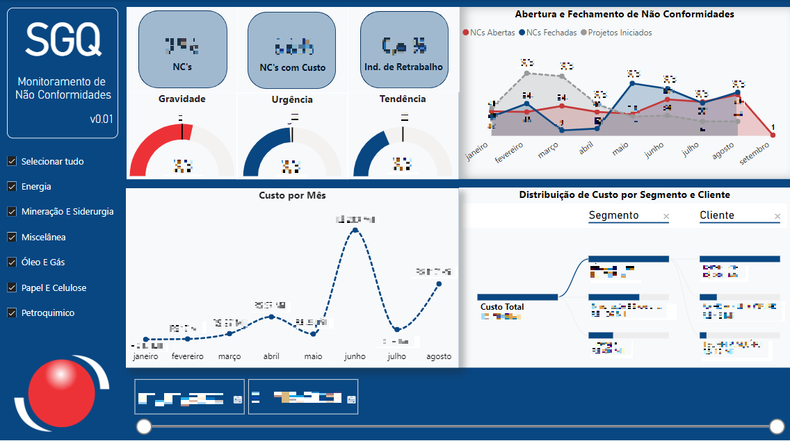

# dashboard-monitoramento-nao-conformidades
Dashboard para acompanhamento das não conformidades da HKM Indústria e Comércio



Todos os dados foram distorcidos para proteger as informações confidenciais da empresa.

## Consultas ao banco de dados

O arquivo .sql de cada script foi disponibilizado na pasta **Consultas SQL**. 

### Tabelas de dimensão

#### Segmentos

  ```sql
  --Segmentos
select 
	codigo, 
	nome 
from 
	ttp_movi
where 
	-- Apenas segmentos da empresa 1
	cod_empresa = 1 and 
	-- Apenas segmentos presentes nos orçamentos já criados na empresa 1 (exceto material de cliente)
	nome in (select distinct plano_contas from torcamento_itens where cod_empresa = 1 and plano_contas <> 'MATERIAL DE CLIENTE')
  ```

#### Clientes

  ```sql
--Clientes
select distinct 
	codigo as 'ID', 
	nome as 'Cliente' 
from 
	tcliente 
where 
	-- Considerando apenas a empresa 1
	cod_empresa = 1
  ```

### Tabelas fato

#### Notas Fiscais

  ```sql
--Notas Fiscais
select
	tnf.numero as 'NF',
	convert(date,tnf.dt_emissao) as 'Data Emissão',
	tnf.cancelada as 'Cancelada',
	tnf.nfe_desc_status as 'Status',
	tnf.cfop as 'CFOP',
	tnf.entrada as 'Entrada',
	tnf.saida as 'Saída',
	tnfi.codigo as 'Cod Interno',
	-- Identifica o número do serviço (OS), caso não haja, procura pelo código interno do material
	isnull(tos.n_os,(select top 1 n_os from tos where cod_empresa=1 and n_os not like 'e%'and cod_pecas=tnfi.codigo)) as 'OS',
	tnfi.produto as 'Produto',
	tnfi.qtde as 'Qtd da NF',
	tnfi.unidade as 'Un',
	tnfi.vl_total + tnfi.vl_ipi as 'Valor',
	-- Identifica a ordem de faturamento da NF
	(select top 1 codigo from tordem_fat where cod_empresa = 1 and status=1 and numero_nf = tnf.numero) as 'OF',
	-- Identifica a quantidade faturada pelo orçamento, ou pelo código interno do material
	isnull(toi.qtde_faturada,(select top 1 qtde_faturada from torcamento_itens where cod_empresa=1 and cod_interno = tnfi.codigo)) as 'Qtd Total Faturada (Orçamento)',
	-- Identifica a quantidade pelo orçamento, ou pelo ´código interno do material
	isnull(toi.qtde,(select top 1 qtde from torcamento_itens where cod_empresa=1 and cod_interno=tnfi.codigo)) as 'Qtd Total (Orçamento)',
	-- Quantidade solicitada subtraída da quantidade já faturada. Retorna 0 caso encontre valor negativo
	case
		when isnull(toi.qtde,(select top 1 qtde from torcamento_itens where cod_empresa=1 and cod_interno=tnfi.codigo))-isnull(toi.qtde_faturada,(select top 1 qtde_faturada from torcamento_itens where cod_empresa=1 and cod_interno = tnfi.codigo)) < 0 then 0
		else isnull(toi.qtde,(select top 1 qtde from torcamento_itens where cod_empresa=1 and cod_interno=tnfi.codigo))-isnull(toi.qtde_faturada,(select top 1 qtde_faturada from torcamento_itens where cod_empresa=1 and cod_interno = tnfi.codigo))
	end as 'Qtd Não Faturada (Orçamento)'
from
	(select * from tnota_fiscal_item where cod_empresa=1) as tnfi

-- Relacionamento com a tabela principal de notas fiscais. Apenas notas da empresa 1, com condição de pagamento existente e notas fiscais não devolvidas
inner join (select * from tnota_fiscal where cod_empresa=1 and condicao_pagamento is not null and condicao_pagamento <> '' and numero not in (select distinct nfref_numero_nf from tnota_fiscal_nfref where cod_empresa =1)) as tnf
	on tnfi.numero_nf = tnf.numero

-- Relacionamento com as tabelas de orçamento. Apenas orçamentos da empresa 1, que foram ganhos na versão atual
left join (select * from torcamento_itens where cod_empresa=1) as toi
	on tnfi.guid_orcamento = toi.guid_linha 
		left join (select * from torcamento where cod_empresa = 1 and estagio_orc = 'GANHOU' and status=1) as tor
			on toi.cod_orcamento = tor.codigo

-- Relacionamento com a tabela de serviços. Apenas OSs que não são de estrutura
left join (select * from tos where cod_empresa=1 and n_os not like 'e%') as tos
	on tnfi.guid_orcamento = tos.guid_orcamento

where
	-- Considerar apenas NFs cujo material foi produzido pela empresa 1
	tnfi.codigo in (select distinct cod_pecas from tos where cod_empresa=1)
  ```

#### OS's

  ```sql
--OS's
select
	convert(int,tos.n_os) as 'OS',
	tos.titulo as 'Título',
	toi.plano_contas as 'Segmento',
	tor.cod_cliente as 'Cód. Cliente',
	tor.cliente as 'Cliente',
	-- Retorna o menor valor de data do apontamento
	min(convert(date,tapont.data)) as 'Primeiro Apontamento'
from
	(select * from tctrl_ph where cod_empresa = 1) as tapont

-- Relacionamento com a tabela de processos produtivos, apenas da empresa 1
inner join (select * from tpro_pro where cod_empresa = 1) as tpp
	on tapont.cod_barr = tpp.codigo
		-- Relacionamento com a tabela de ordens de serviço (OS's). Apenas da empresa 1 e não considerando OS's de estrutura
		inner join (select * from tos where cod_empresa = 1 and n_os not like 'e%') as tos
			on tpp.cod_os = tos.codigo
				-- Relacionamento com as tabelas de orçamento. Considera-se apenas a empresa 1 e desconsidera materiais de cliente (erros de digitação)
				inner join (select * from torcamento_itens where cod_empresa = 1 and plano_contas <> 'MATERIAL DE CLIENTE') as toi
					on tos.guid_orcamento = toi.guid_linha
						inner join (select * from torcamento where cod_empresa = 1) as tor
							on toi.cod_orcamento = tor.codigo

group by 
	-- Agrupando as informações do apontamento por OS's e suas informações orçamentárias
	convert(int,tos.n_os), tos.titulo, toi.plano_contas, tor.cod_cliente, tor.cliente

order by 
	-- Ordenando por OS's de maneira decrescente
	convert(int,tos.n_os) desc
  ```

#### Não Conformidades

  ```sql
--Não Conformidades
select 
	tnc.codigo as 'N',
	toi.plano_contas as 'Segmento',
	tor.cod_cliente as 'Cód. Cliente',
	tor.cliente as 'Cliente',
	familia_n_conforme as 'Família',
	cod_os_completo as 'OS',
	fase as 'Setor/Fase',
	convert(date,data) as 'Data de Abertura',
	-- Verifica se a não conformidade possui data de eficácia e data de conclusão para classificá-la como concluída
	case
		when 
			case
				when dt_efetiva_eficacia >= dt_conclusao then convert(date,dt_efetiva_eficacia)
				else convert(date,dt_conclusao)
			end is not null then 1
		else 0
	end as 'Concluído',
	-- Define o maior entre data de conclusão e data de eficácia e o chama de data de fechamento
	case
		when dt_efetiva_eficacia >= dt_conclusao then convert(date,dt_efetiva_eficacia)
		else convert(date,dt_conclusao)
	end as 'Data de Fechamento',
	-- Calcula o tempo em dias para a resolução da NC
	(case
		when dt_efetiva_eficacia >= dt_conclusao then convert(int,dt_efetiva_eficacia)
		else convert(int,dt_conclusao)
	end - convert(int,data)) as 'Tempo (Dias)',
	-- Define a metodologia utilizada através da data
	case
		when data < '2023-06-01' then 'PFMEA'
		else 'GUT'
	end as 'GUT/PFMEA',
	valor_campo_adicional5 as 'Nota1',
	valor_campo_adicional6 as 'Nota2',
	valor_campo_adicional7 as 'Nota3',
	-- Multiplica as três notas da metodologia e obtém o valor final
	(convert(int,valor_campo_adicional5)*convert(int,valor_campo_adicional6)*convert(int,valor_campo_adicional7)) as 'Nota Final',
	-- Define o IR baseado na metodologia utilizada e seus valores de nota final
	case
		when data < '2023-06-01' then 
			case
				when (convert(int,valor_campo_adicional5)*convert(int,valor_campo_adicional6)*convert(int,valor_campo_adicional7)) <= 100 then 'Baixo'
				when (convert(int,valor_campo_adicional5)*convert(int,valor_campo_adicional6)*convert(int,valor_campo_adicional7)) <= 500 then 'Moderado'
				when (convert(int,valor_campo_adicional5)*convert(int,valor_campo_adicional6)*convert(int,valor_campo_adicional7)) <= 1000 then 'Alto'
			end
		else 
			case
				when (convert(int,valor_campo_adicional5)*convert(int,valor_campo_adicional6)*convert(int,valor_campo_adicional7)) <= 50 then 'Baixo'
				when (convert(int,valor_campo_adicional5)*convert(int,valor_campo_adicional6)*convert(int,valor_campo_adicional7)) <= 100 then 'Moderado'
				when (convert(int,valor_campo_adicional5)*convert(int,valor_campo_adicional6)*convert(int,valor_campo_adicional7)) <= 125 then 'Alto'
			end
	end as 'Índice de Risco',
	-- Converte o texto de custo em valor
	convert(float,replace(replace(valor_campo_adicional2,'.',''),',','.')) as 'Custo'
from 
	tn_conformidade as tnc

-- Relacionamento com a tabela de ordens de serviço, considerando apenas a empresa 1
left join (select codigo, guid_orcamento from tos where cod_empresa = 1) as tos
	on tnc.cod_os = tos.codigo
		-- Relacionamento com as tabelas de orçamento, considerando apenas a empresa 1
		left join (select guid_linha, cod_orcamento, plano_contas from torcamento_itens where cod_empresa = 1) as toi
			on tos.guid_orcamento = toi.guid_linha
				left join (select codigo, cod_cliente, cliente from torcamento where cod_empresa = 1) as tor
					on toi.cod_orcamento = tor.codigo

where
	cod_empresa = 1 and 
	-- Desconsiderando orçamentos de material de cliente (erro de digitação)
    toi.plano_contas <> 'MATERIAL DE CLIENTE'
  ```

## Diagrama de Entidade Relacional


